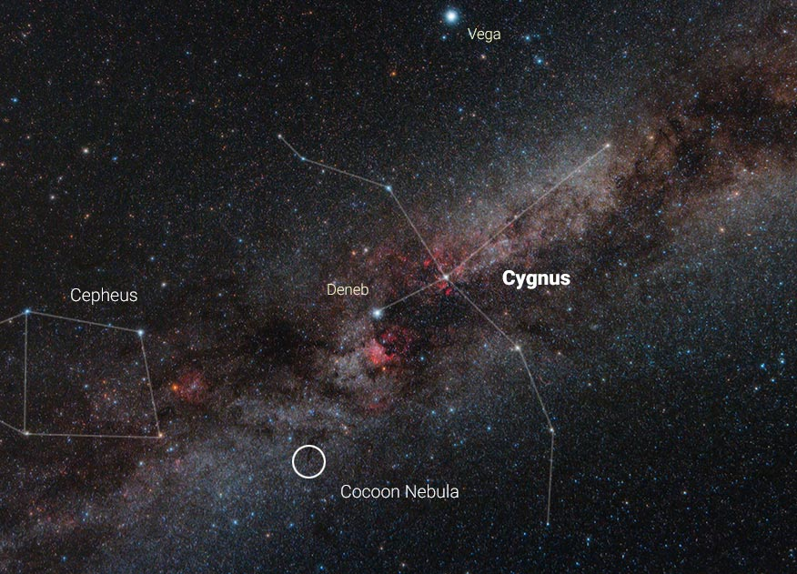

The [****IC5146 aka the Cocoon Nebula****](https://en.wikipedia.org/wiki/IC_5146). October 2021.

### Object	

The Cocoon Nebula, also known as IC 5146, is an astronomical object that combines a reflection nebula, emission nebula, and dark nebula. 

The Cocoon Nebula spans approximately 12 arcminutes in the night sky, making it the smallest object I have imaged to date. In real terms, this translates to about 15 light years across. It is located 2500±100 light years from Earth in the constellation Cygnus.

This nebula is notable for its central young hot star. This star's intense radiation and stellar winds illuminate and shape the surrounding gas and dust, resulting in an awesome visual effect that highlights the nebula's intricate structure. [Here is a great paper with detail about this phenomenon](https://arxiv.org/pdf/1410.0119.pdf).

If you look closely, you can see long dark nebula B168 extending from the center of the Cocoon Nebula across the image to the right.

### Color palette

Since it IC5146 is a reflection nebula, primarily made up of dust particles that reflect the light of nearby stars, it is best imaged using a LRGB (Luminance, Red, Green, Blue) filter set.

### Location

Home observatory-on-balcony in Cottbus, Germany. 

### For nerds 

- Light pollution: with [**SQM**](https://en.wikipedia.org/wiki/Sky_quality_meter) of 19.89 mag./arc sec2 center of Cottbus is around [**Bortle 5 sky**](https://www.handprint.com/ASTRO/bortle.html). 
- Imaging optics:	 William Optics ZenithStar 80mm f/6.8 ED Refractor and WO Flat6AIII (0.8x)
- Mount:	SW HEQ5 PRO
- Camera:	ZWO ASI-294MM
- Filters:	ZWO LRGB
- Guiding:	WO 50mm f/4 Guide Scope and ASI120MM-Mini
- Other tech: ZWO EFW, ZWO EAF 
- Imaging @ Gain: 120 | Cooling:	-10C | Bin1 (8288*5644px)
- Integration: ca. 20L, 10R, 10G, 10B x 300" exposures per image all filters.
- Software: PixInsight, Stellarium

