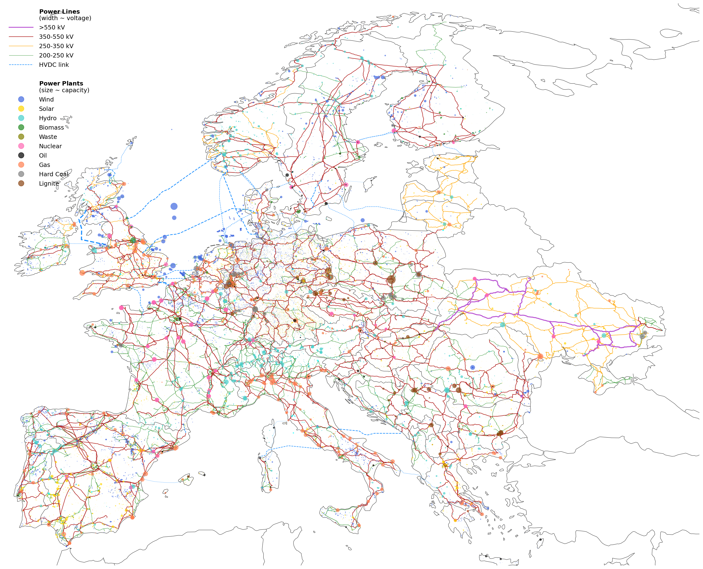
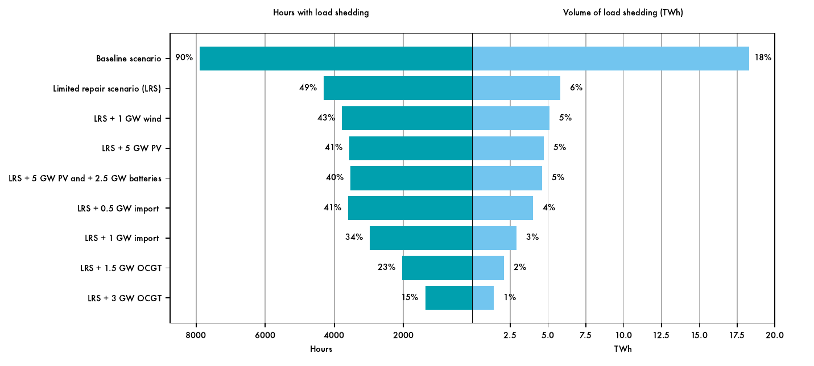
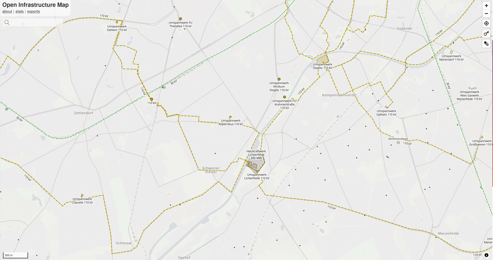

# Open-source data, tools and energy system models for civil society protection

**Iegor Riepin · Postdoc, ENSYS TU Berlin**
Civil Resilience Forum Berlin 2026 · 5-minute talk

---
## Who I am and what we build (~1 min)

I'm a postdoc at the Energy Systems group at TU Berlin. We do research and teaching in energy systems modelling and analysis. The overarching goal of our work is to identify cost-effective pathways to climate neutrality, using computer models to inform policy and public discourse. We co-develop and maintain PyPSA ecosystem -- an open-source ecosystem of tools and models for energy system modelling https://pypsa.org/

Energy models collect large datasets (grid topology, power lines, generators, storage, loads) and encode them into mathematical representations of how energy flows and markets operate. The result is a platform for asking "what if" questions: what happens to system costs if we replace fossil gas in power generation with renewables and in heating with heat pumps? What's the cheapest path to net zero by 2050? How resilient is the grid to a loss of certain infrastructure assets?

These models are used at every level of decision-making: project developers, TSOs, national energy and climate plans (NECPs), regulators, and research institutions across Europe and beyond.

---
### Energy modelling for resilience (~2 min)

There is much of academic and institutional work on using energy system resilience analysis. Great recent examples are IEA's energy system resilience report and Eurelectric's study on battle-tested power systems:

https://www.iea.org/reports/energy-system-resilience  
https://www.eurelectric.org/publications/battle-tested-power-systems/

In 2022, our group extended the open-source European energy market model PyPSA-Eur to cover Ukraine and Moldova -- originally to give a warm start for everyone who wanted to work on Ukraine's energy crisis caused by the Russian full scale invasion  https://pypsa-eur.readthedocs.io/en/stable/index.html

*Source: [PyPSA-Eur](https://github.com/PyPSA/pypsa-eur) contributors (MIT License)*

Since then, a dozen research groups have used these tools for short- and long-term reconstruction planning in Ukraine (shoot me an email to get in contact)

An example: a joint report by Green Deal Ukraine https://greendealukraina.org/ and TU Berlin team used techno-economic modelling to evaluate which interventions could most effectively help Ukraine survive winter energy crises -- restoring damaged generation capacity, boosting cross-border transfer capacity with the EU, and deploying fast, decentralised generation and storage: https://doi.org/10.1016/j.esr.2025.101724 

*Source: Zachmann, Meissner & Riepin (2025), "Mitigating Ukraine's looming electricity crisis", Energy Strategy Reviews. [doi:10.1016/j.esr.2025.101724](https://doi.org/10.1016/j.esr.2025.101724)*

> Message for this room: If you work on short- or medium-term energy resilience planning, the open tools to reproduce or extend this kind of analysis are at  https://pypsa.org/ and https://pypsa-eur.readthedocs.io/en/latest/. We're open to support initiatives aimed at improving civil society protection (technically, outreach, etc.)

> Message for people w/ focus on Ukraine's energy system resilience: [the report](https://doi.org/10.1016/j.esr.2025.101724) (no paywall) & [work of the GDU team more broadly](https://greendealukraina.org/products/analytical-reports)

---
## The Berlin blackout and the open data question (~2 min)

The January 2026 blackout in parts of Berlin raised a lot of attention to open about infrastructure data. Tools like OpenInfraMap allow anyone to explore the topology of the electricity grid, gas pipelines, and substations at street level https://openinframap.org/#13.86/52.42948/13.30546/A,B,L,P

*Source: [OpenInfraMap](https://openinframap.org/) · Map data © [OpenStreetMap contributors](https://www.openstreetmap.org/copyright) (ODbL)*

This data has enormous legitimate value for civil society: for researchers, urban planners, NGOs, climate modellers, and RES developers. Our energy modelling  data pipeline draws on exactly this kind of open infrastructure data.

> **Message 1 on open data pipeline:** If you need to process open energy system data for your work, the PyPSA-Eur open repository ([github.com/PyPSA/pypsa-eur](https://pypsa-eur.readthedocs.io/en/latest/)) is a good starting point. For high-/medium voltage grid data processing see https://www.nature.com/articles/s41597-025-04550-7. If you're doing work that matters for civil society resilience and want help getting started, reach out to us directly.

> **Message 2 on security by obscurity:** A dangerous fallacy: restrict access to infrastructure data so adversaries can't use it. The assumption is that if terrorists or hostile intelligence services don't know where the lines run, they can't attack them. This is an illusion. Commercial satellite imagery already maps every substation at [50cm resolution](https://www.planet.com/products/high-resolution-satellite-imagery/). Intelligence agencies maintain detailed infrastructure models. Public grid studies, satellite imagery, commercial datasets web archive and etc. make this information easily available to those who look. Restricting open data doesn't affect actors with bad intentions at all --- it just makes access harder for good actors (civil society) who depend on it.

> **Message 3 on the real fix:** The Spiegel investigation into the Berlin incident found that the cable bridge had been nearly unguarded and physically accessible for months https://www.spiegel.de/panorama/justiz/stromausfall-in-berlin-kabelbruecke-monatelang-nahezu-ungeschuetzt-und-zugaenglich-a-02826558-8ac9-48ae-8293-41c3573cd80e That means: Protecting the vulnerable parts and redundancy where possible.

